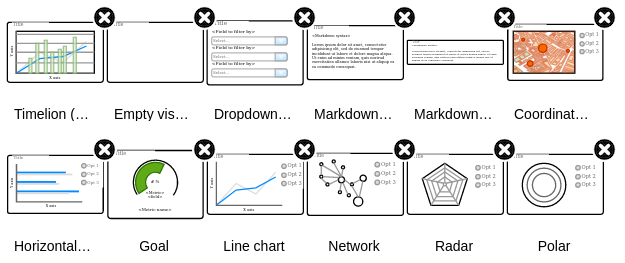
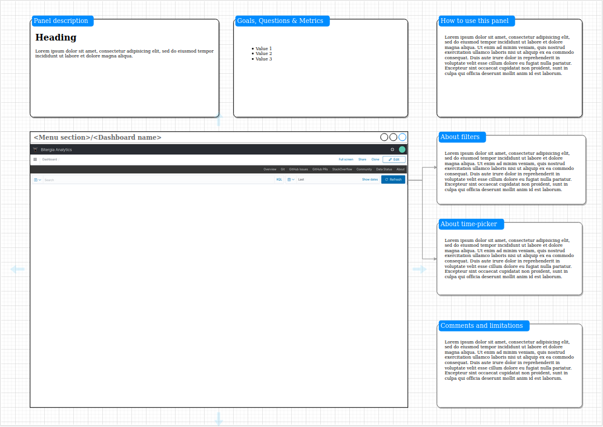

# Dashboard Mockups

This repository aims to gather the tools and instructions to create mockups for Dashboards and Visualizations. Bitergia is using Kidash, a version of ElasticSearch's Kibana, to produce dashboards and visualizations.

## Kibana Mockups

This is a shape library for [Diagrams app](https://app.diagrams.net/) to create Mock-ups of Kibana visualizations and dashboards.

It contains most of the visualizations and elements we commonly use from Kibana interface, using shapes from Mockup library and other Diagram shape libraries. This library includes an empty panel shape where other visualization shapes can be arranged to create a mock-up for a panel (see pictures at the end of this comment [1]).

Together with this shape library, there is a template [2] which layout contains the
panel mock-up itself along with empty text boxes to detail information about the panel, such as:

* Panel description (Title + general goal or use case the panel is meant to answer).
* Goals, Questions & Metrics covered on this panel (links to the Metrics Strategy documents).
* How to use this panel (Where and what to look at, specific details about how it works)
* About filters (Global filters applied to the dashboard, any other filter that would be +needed).
* About time-picker (default date range, which date field is used, etc.)
* Comments and limitations (other specific comments about the panel, known limitations if it is the case).

### How to import the shape library

First, make sure the mockup and prototype libraries are enabled by clicking on *More shapes…* at the bottom of the left-hand panel.

Then, click on **File** -> **Open Library From** -> **URL**, and then paste the URL of the Kibana-mockups shape library from this repository.

### Mock-up process

The process to produce a mock-up would consist on:

* Define the objective (use-case from a goal, sets of questions)
* Start from a copy of the main template
* Arrange the visualizations that could form the panel using the custom shape library
* Fill the text boxes with the appropriate description and details

---

[1]

[2]

